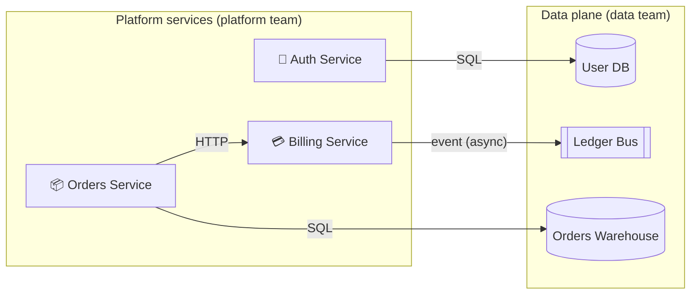

# Architecture overview

The platform is split across two ownership regions: **Platform services**
(user-facing) and the **Data plane** (shared infrastructure). Services are
deployed independently and communicate over HTTP plus the ledger bus.

## System diagram

## Edge inventory

| From | To | Protocol | Kind |
| --- | --- | --- | --- |
| Auth Service | User DB | SQL | data |
| Billing Service | Ledger Bus | event | async |
| Orders Service | Billing Service | HTTP | sync |
| Orders Service | Orders Warehouse | SQL | data |

## Ownership

| Region | Team | Description |
| --- | --- | --- |
| Platform services | Platform team | User-facing services owned by the platform team. All three are deployed independently and talk over HTTP + the ledger bus. |
| Data plane | Data team | Shared infrastructure. |

## Cross-cutting concerns

- **Pricing ownership** — pricing endpoints currently live in Billing but will
  move to Orders next sprint. See
  [`decisions/open-questions.md`](./decisions/open-questions.md).
- **Warehouse retention** — Orders Warehouse retains data for 90 days; legal
  sign-off pending.
