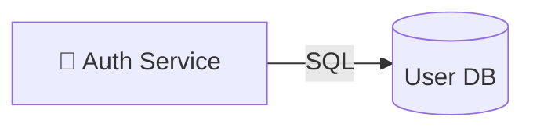

# 🔐 Auth Service

- **Kind:** Component
- **Region:** [Platform services](../regions/platform-services.md)
- **Owner:** Platform team

## Responsibilities

User authentication for the platform. Stores credentials and session data in the
User DB.

## Dependencies

| Target | Protocol | Kind |
| --- | --- | --- |
| [User DB](./user-db.md) | SQL | data |

## Consumers

None recorded on the canvas — Auth is a leaf in the current graph (other
services do not call it directly via a recorded edge).

