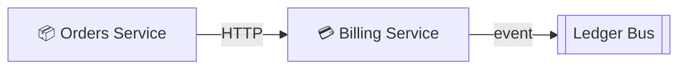

# 💳 Billing Service

- **Kind:** Component
- **Region:** [Platform services](../regions/platform-services.md)
- **Owner:** Platform team

## Responsibilities

Charges customers and emits billing events onto the ledger bus.

> **Heads up:** Pricing endpoints are scheduled to move to the Orders Service
> next sprint. See
> [open questions › pricing ownership](../decisions/open-questions.md#pricing-ownership).

## Dependencies

| Target | Protocol | Kind |
| --- | --- | --- |
| [Ledger Bus](./ledger-bus.md) | event | async |

## Consumers

| Source | Protocol | Kind |
| --- | --- | --- |
| [Orders Service](./orders-service.md) | HTTP | sync |

