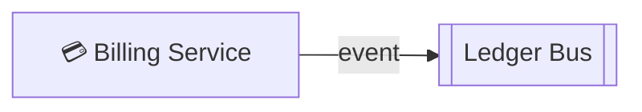

# Ledger Bus

- **Kind:** Bus
- **Region:** [Data plane](../regions/data-plane.md)
- **Owner:** Data team

## Purpose

Async event bus that carries financial / ledger events between platform
services.

## Inbound

| Source | Protocol | Kind |
| --- | --- | --- |
| [Billing Service](./billing-service.md) | event | async |

## Outbound

No subscribers recorded on the canvas yet.

