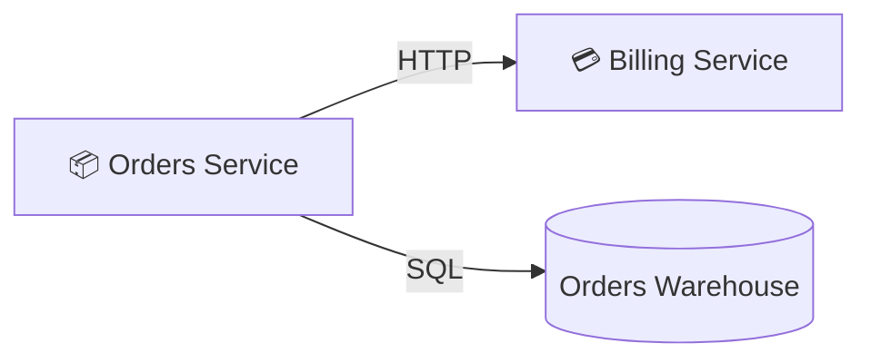

# 📦 Orders Service

- **Kind:** Component
- **Region:** [Platform services](../regions/platform-services.md)
- **Owner:** Platform team

## Responsibilities

Owns the order lifecycle. Talks to Billing synchronously for payment and writes
order history to the Orders Warehouse.

## Dependencies

| Target | Protocol | Kind |
| --- | --- | --- |
| [Billing Service](./billing-service.md) | HTTP | sync |
| [Orders Warehouse](./orders-warehouse.md) | SQL | data |

## Consumers

No recorded callers on the canvas.

## Upcoming work

- Absorb pricing endpoints currently in Billing (see
  [open questions](../decisions/open-questions.md#pricing-ownership)).
