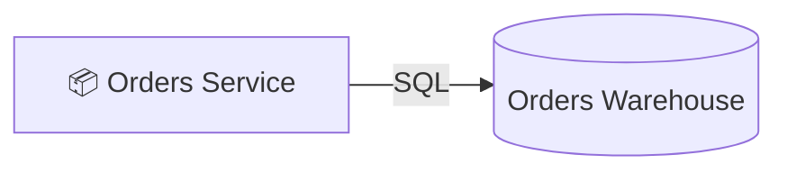

# Orders Warehouse

- **Kind:** Database
- **Region:** [Data plane](../regions/data-plane.md)
- **Owner:** Data team

## Purpose

Long-lived analytical store for order history.

> **Retention:** 90 days. Legal sign-off pending — see
> [open questions › warehouse retention](../decisions/open-questions.md#warehouse-retention).

## Inbound

| Source | Protocol | Kind |
| --- | --- | --- |
| [Orders Service](./orders-service.md) | SQL | data |

