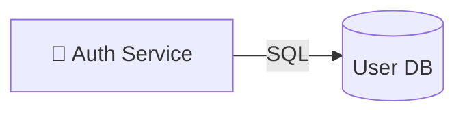

# User DB

- **Kind:** Database
- **Region:** [Data plane](../regions/data-plane.md)
- **Owner:** Data team

## Purpose

Primary store for user identity and credentials.

## Inbound

| Source | Protocol | Kind |
| --- | --- | --- |
| [Auth Service](./auth-service.md) | SQL | data |

