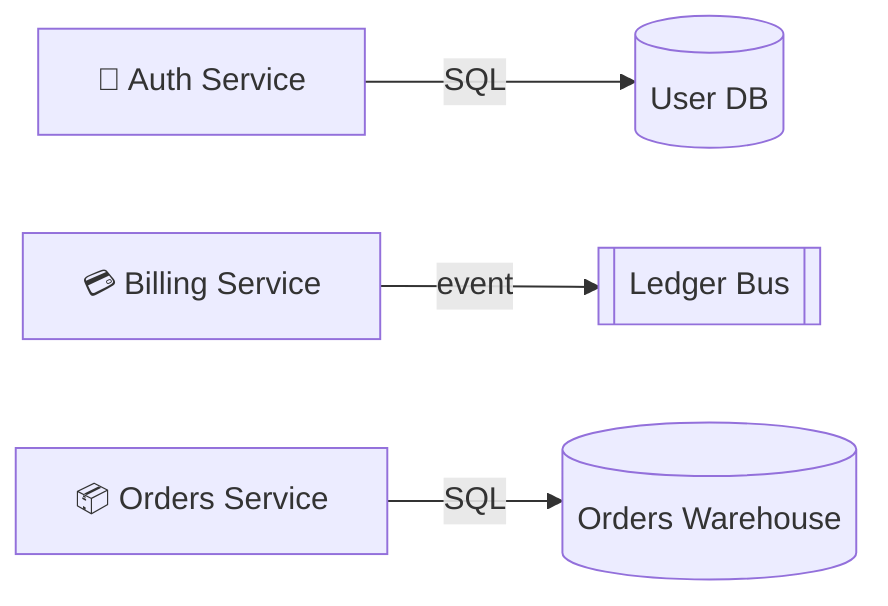

# Region: Data plane

**Owner:** Data team
**Accent:** `#34d399`

Shared infrastructure used by the platform services.

## Components in this region

| Component | Kind | Page |
| --- | --- | --- |
| User DB | Database | [user-db](../components/user-db.md) |
| Ledger Bus | Bus | [ledger-bus](../components/ledger-bus.md) |
| Orders Warehouse | Database | [orders-warehouse](../components/orders-warehouse.md) |

## Inbound traffic

## Open annotations touching this region

- [Warehouse retention](../decisions/open-questions.md#warehouse-retention)
  (encloses Orders Warehouse)
