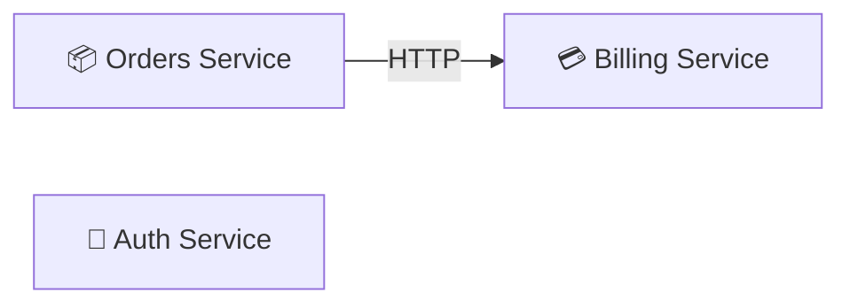

# Region: Platform services

**Owner:** Platform team
**Accent:** `#60a5fa`

User-facing services owned by the platform team. All three are deployed
independently and talk over HTTP + the ledger bus.

## Components in this region

| Component | Kind | Page |
| --- | --- | --- |
| 🔐 Auth Service | Component | [auth-service](../components/auth-service.md) |
| 💳 Billing Service | Component | [billing-service](../components/billing-service.md) |
| 📦 Orders Service | Component | [orders-service](../components/orders-service.md) |

## Internal interactions

Auth has no intra-region edges in the current canvas — it only talks to the
User DB in the data plane.

## External dependencies

- Auth Service → [User DB](../components/user-db.md) (SQL)
- Billing Service → [Ledger Bus](../components/ledger-bus.md) (async event)
- Orders Service → [Orders Warehouse](../components/orders-warehouse.md) (SQL)

## Open annotations touching this region

- [Pricing ownership move](../decisions/open-questions.md#pricing-ownership)
  (encloses Billing + Orders)
