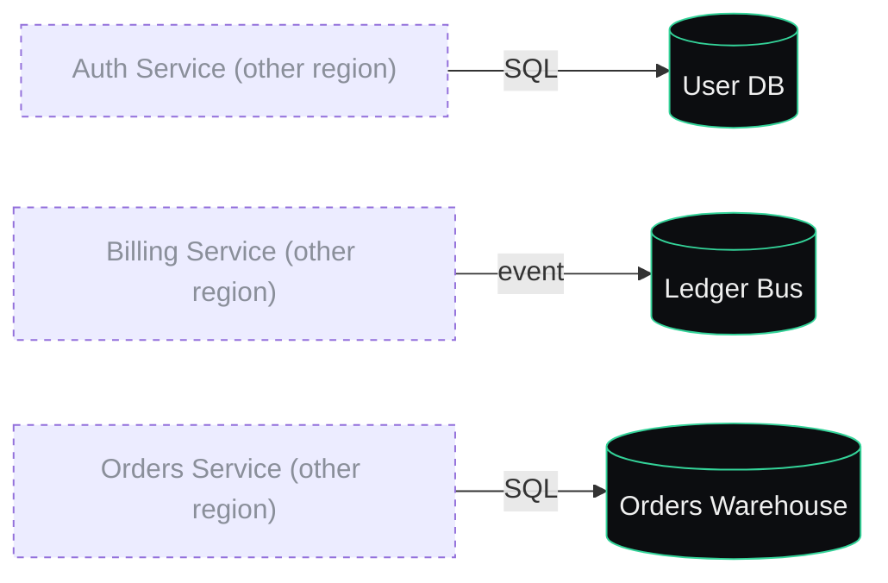

# Data plane

Shared infrastructure. Owned by the data team.

## Wiring

## Entities

| ID | Title | Kind | Accent |
| --- | --- | --- | --- |
| `db_users` | User DB | Database | `#34d399` |
| `bus_ledger` | Ledger Bus | Bus | `#34d399` |
| `warehouse_orders` | Orders Warehouse | Database | `#34d399` |

## Annotations

> **User annotation** — _2026-05-13_
>
> "Warehouse retention is 90 days — flag this in the deck so legal can sign off."
>
> Touches: [`warehouse_orders`](#warehouse_orders)
>
> Status: unresolved

---

← [Back to index](./index.md)
