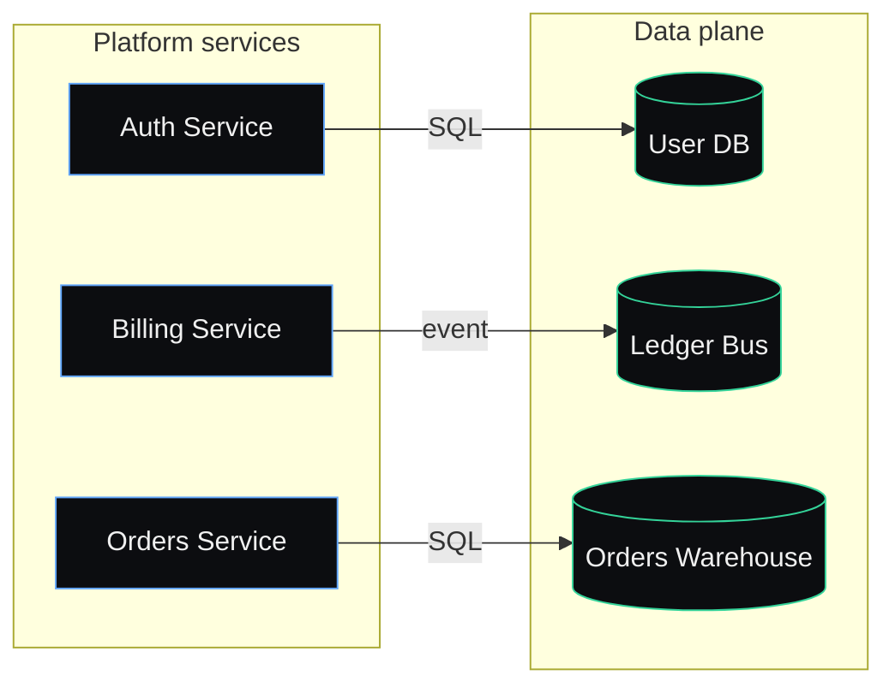

# Order Fulfilment Platform

> Exported from the live-render workspace at
> `/home/liangshih.lin/GitHub/flow-marketplace/plugins/live-canvas/live-render-to-markdown-workspace/iteration-1/eval-mermaid-per-region/with_skill/project/.claude/live-render-workspace`
> on `2026-05-14T00:00:00Z`.

## Snapshot

| Metric | Count |
| --- | --- |
| Regions | 2 |
| Nodes | 6 |
| Edges | 4 |
| Annotations | 2 |
| Orphans | 0 |

## Regions

- [Platform services](./platform-services.md) — 3 nodes, 1 internal edge, 3 cross-region edges, 1 annotation
- [Data plane](./data-plane.md) — 3 nodes, 0 internal edges, 3 cross-region edges, 1 annotation

## World map

---

_Generated by `live-render-to-markdown` from
`/home/liangshih.lin/GitHub/flow-marketplace/plugins/live-canvas/live-render-to-markdown-workspace/iteration-1/eval-mermaid-per-region/with_skill/project/.claude/live-render-workspace`
at `2026-05-14T00:00:00Z`. To regenerate, re-run the skill against the
live-render workspace._
