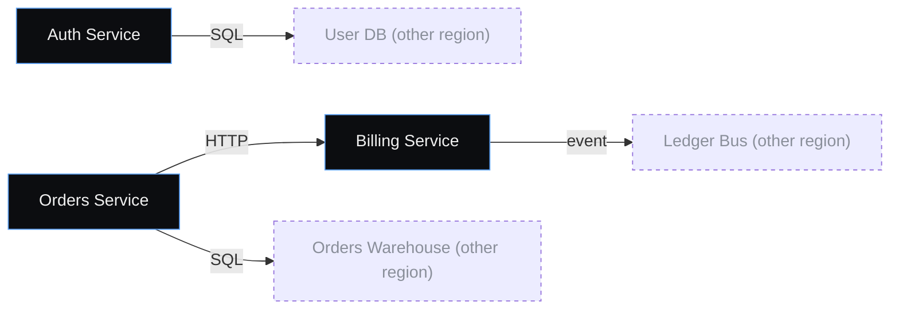

# Platform services

User-facing services owned by the platform team. All three are deployed
independently and talk over HTTP + the ledger bus.

## Wiring

## Entities

| ID | Title | Kind | Accent |
| --- | --- | --- | --- |
| `svc_auth` | 🔐 Auth Service | Component | `#60a5fa` |
| `svc_billing` | 💳 Billing Service | Component | `#60a5fa` |
| `svc_orders` | 📦 Orders Service | Component | `#60a5fa` |

## Annotations

> **User annotation** — _2026-05-13_
>
> "We agreed at standup that the billing service should not own pricing — move pricing-related endpoints to orders next sprint."
>
> Touches: [`svc_billing`](#svc_billing), [`svc_orders`](#svc_orders)
>
> Status: unresolved

---

← [Back to index](./index.md)
