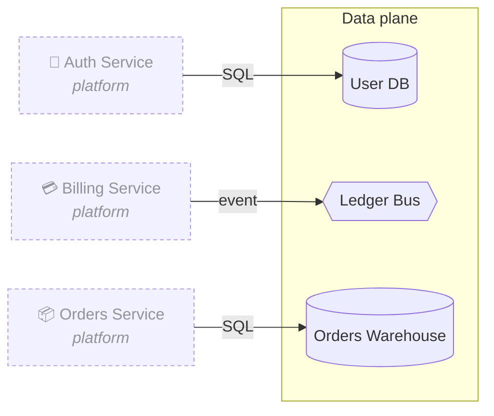

# Data plane

> Shared infrastructure. Owned by the data team.

[← Back to index](./index.md)

## Components

| Component | Kind |
| --- | --- |
| User DB | Database |
| Ledger Bus | Bus |
| Orders Warehouse | Database |

## Diagram

## Edges (incoming)

- **Auth Service → User DB** — `SQL` (data).
- **Billing Service → Ledger Bus** — `event` (async).
- **Orders Service → Orders Warehouse** — `SQL` (data).

## Annotations

The following annotation on the canvas is anchored to an entity in this region (`warehouse_orders`):

> Warehouse retention is 90 days — flag this in the deck so legal can sign off.
>
> — _unresolved, created 2025-05-14_
