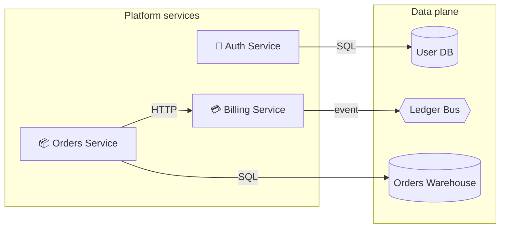

# Order Fulfilment Platform

This document describes the Order Fulfilment Platform, organised by region. Each region has its own page with a Mermaid diagram of the components and edges that live within (or cross into) that region.

## Regions

- [Platform services](./platform-services.md) — user-facing services owned by the platform team.
- [Data plane](./data-plane.md) — shared infrastructure owned by the data team.

## System overview

## Open annotations

There are 2 unresolved annotations on the canvas. They are reproduced as quoted callouts on the region pages where their referenced entities live:

- "We agreed at standup that the billing service should not own pricing…" — see [Platform services](./platform-services.md#annotations).
- "Warehouse retention is 90 days…" — see [Data plane](./data-plane.md#annotations).
