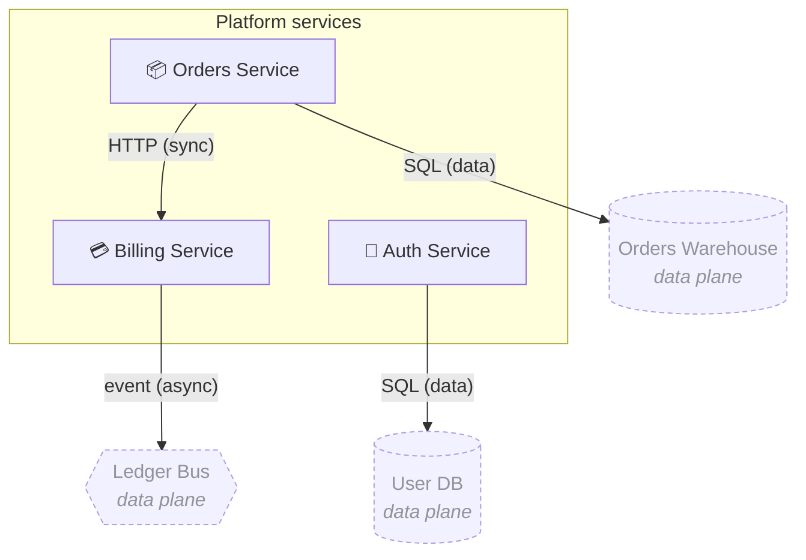

# Platform services

> User-facing services owned by the platform team. All three are deployed independently and talk over HTTP + the ledger bus.

[← Back to index](./index.md)

## Components

| Component | Kind | Icon |
| --- | --- | --- |
| Auth Service | Component | 🔐 |
| Billing Service | Component | 💳 |
| Orders Service | Component | 📦 |

## Diagram

## Edges

- **Orders → Billing** — `HTTP` (sync call inside the platform region).
- **Auth → User DB** — `SQL` (data plane).
- **Billing → Ledger Bus** — `event` (async, data plane).
- **Orders → Orders Warehouse** — `SQL` (data plane).

## Annotations

The following annotation on the canvas is anchored to entities in this region (`svc_billing`, `svc_orders`):

> We agreed at standup that the billing service should not own pricing — move pricing-related endpoints to orders next sprint.
>
> — _unresolved, created 2025-05-14_
