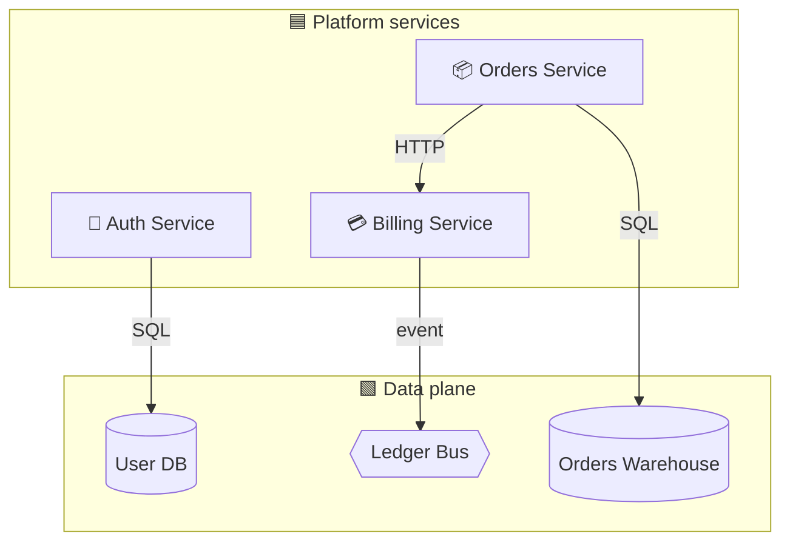

# Order Fulfilment Platform

> Snapshot of the live-render canvas. Self-contained — share the folder in Slack.

## At a glance

- **2 regions** — Platform services, Data plane
- **6 components** — 3 services, 2 databases, 1 bus
- **4 connections** between them
- **2 open annotations** (action items)

## Architecture (mobile-friendly diagram)

## Browse

- [Regions](./regions/) — logical groupings
  - [Platform services](./regions/platform-services.md)
  - [Data plane](./regions/data-plane.md)
- [Services](./services/)
  - [Auth Service](./services/auth-service.md)
  - [Billing Service](./services/billing-service.md)
  - [Orders Service](./services/orders-service.md)
- [Data stores](./data/)
  - [User DB](./data/user-db.md)
  - [Ledger Bus](./data/ledger-bus.md)
  - [Orders Warehouse](./data/orders-warehouse.md)
- [Annotations / action items](./annotations/README.md)

## Open action items

| # | Item | Touches |
|---|------|---------|
| 1 | Move pricing endpoints from Billing to Orders next sprint | Billing, Orders |
| 2 | Warehouse retention is 90 days — flag for legal sign-off | Orders Warehouse |

---

_Exported from live-render canvas. Snapshot: 2025-05-14._
