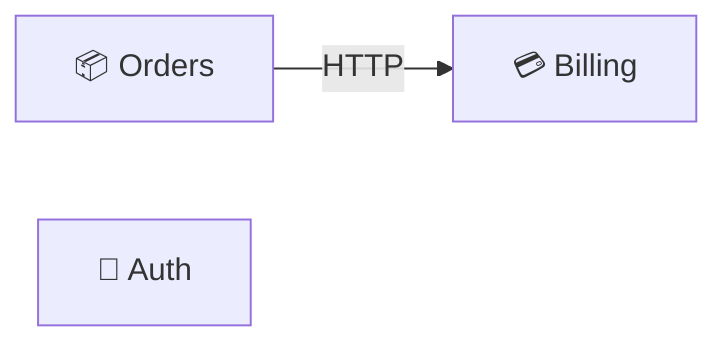

# 🟦 Platform services

User-facing services owned by the platform team. All three are deployed independently and talk over HTTP + the ledger bus.

## Components

- [🔐 Auth Service](../services/auth-service.md)
- [💳 Billing Service](../services/billing-service.md)
- [📦 Orders Service](../services/orders-service.md)

## Internal flow

## Notes

- See annotation: [Pricing should live in Orders, not Billing](../annotations/pricing-ownership.md)

[← Back to overview](../README.md)
