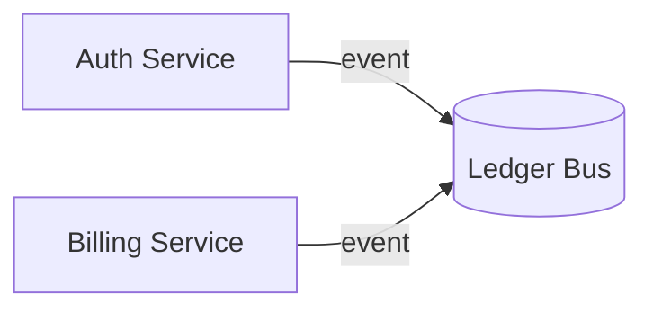
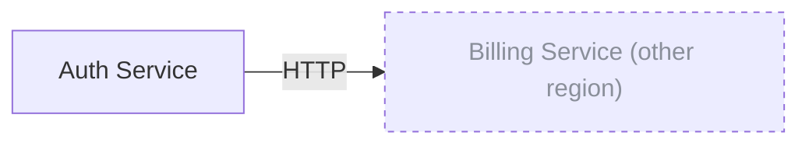
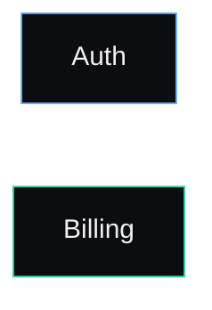
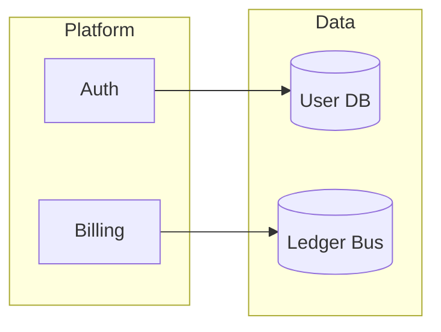

# Mermaid Patterns

Read this in Phase 3 and Phase 4 when generating the world map and
per-region diagrams. It documents the translation from world edges to
Mermaid syntax, the cross-region link pattern, and the rules for when to
*skip* a diagram (dense subgraphs read worse than the entity table they
replace).

## When to emit a Mermaid diagram

Diagrams help when:

- There are 2–15 nodes in scope
- There are at least 2 edges (otherwise the diagram is a list)
- The relationships are not obvious from the entity table alone

Diagrams *hurt* when:

- There are 0 or 1 edges — just say so in prose
- There are >25 nodes and the diagram becomes a hairball — render a
  collapsed `<details>` block instead and rely on the entity table for
  the canonical listing
- The edges are all the same kind and all flow one way — a numbered list
  reads faster than a diagram

When in doubt, render the diagram. A bad diagram is a low-cost mistake;
omitting one when it would have helped is a higher-cost mistake. The
user can always tell you to drop it.

## Base syntax — directed graph

The default flavour is `flowchart LR` (left-to-right). Use `flowchart TD`
(top-down) only when the region's spatial layout was clearly vertical
(more height than width in the region's bounding box).



Conventions used above:

- Node id is the entity's `id` (snake_case is fine — Mermaid accepts it)
- Node label is `metadata.title` in double quotes
- Edge label is `metadata.label` if set, otherwise omit (use `-->`)
- Cylinder shape `[("…")]` for entities with `metadata.kind` in
  `["Resource", "Database", "Bus", "Topic"]`
- Stadium shape `(("…"))` for entities with `metadata.kind === "API"`
- Default rectangle `["…"]` for everything else

## Cross-region edges

When an edge points outside the current page's region, render the foreign
endpoint as a normal node *and* attach a `click` directive that
navigates to the foreign page:



The `:::external` class and the dashed stroke make foreign nodes visually
distinct. The `click` directive makes the markdown render-engine open
the foreign page when clicked (works in GitHub, GitLab, VS Code preview).

## Status / kind colouring

Optionally, colour nodes by `metadata.accent`. Mermaid's `style`
directive is the cleanest way:



Map the runtime's colour tokens to fixed hex values for portability — a
viewer rendering markdown doesn't have access to CSS variables.

| Token | Hex |
| --- | --- |
| `var(--accent)` | `#e8ff47` |
| `var(--blue)` | `#60a5fa` |
| `var(--green)` | `#34d399` |
| `var(--orange)` | `#fb923c` |
| `var(--red)` | `#f87171` |

Default to `--text-secondary` (`#8a8f9a`) for stroke when accent is unset.

## Annotation overlays

Annotations are *not* in the diagram. They appear below as quoted
callouts:

```markdown
> **User annotation** — _2026-05-12_
>
> "this color is wrong, make it warmer"
>
> Touches: [`svc_auth`](#svc_auth), [`svc_billing`](#svc_billing)
```

The reason annotations stay out of the diagram: they're spatial overlays
in the canvas, but in markdown they become asynchronous TODOs. A
Mermaid bubble inside the graph would make them look like first-class
nodes, which they aren't.

## The world map (index.md only)

The diagram on `index.md` is a subgraph view — one Mermaid `subgraph` per
region, with cross-region edges between subgraphs. Skip *intra-region*
edges entirely; those live on the region pages.



Subgraph titles are the region titles. The `click` directive on the
subgraph (not just individual nodes) lets the user jump to the per-region
page by clicking the subgraph border.

## When Mermaid breaks

A few real-world quirks worth knowing:

- **Quotes in labels.** Mermaid is sensitive to unescaped `"` inside
  labels. Replace `"` with `&quot;` or use the `\"` escape inside the
  quoted label.
- **Markdown in labels.** Mermaid does not render markdown inside
  labels. If a node title contains backticks or asterisks, strip them
  for the diagram and keep them in the surrounding prose.
- **Long labels.** Anything over ~40 chars wraps poorly. Truncate to
  ~30 chars + `…` for the label and let the entity table show the full
  text.
- **Empty diagrams.** A region with one node and zero edges should not
  emit a diagram — emit a single sentence like
  `Single entity: [Auth Service](#svc_auth).` instead.
